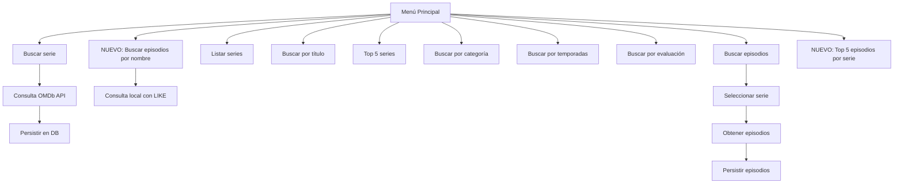

# Resumen de Aprendizajes - Spring Boot + PostgreSQL + OMDb API (Actualizado)

## Tecnologías Integradas

### 🏗️ Spring Boot Framework
- Creación de aplicaciones Java con configuración automática
- Uso de `@SpringBootApplication` para iniciar la aplicación
- Implementación de `CommandLineRunner` para ejecución al iniciar
- Spring Data JPA para operaciones avanzadas con bases de datos
- **Nuevo**: Paginación con `Pageable` y `PageRequest`

### 🐘 PostgreSQL Database
- Configuración de entidades con JPA annotations:
  - `@Entity` para mapear clases a tablas
  - `@Id` para identificar la llave primaria
  - `@GeneratedValue` para autoincrementar IDs
  - `@Column` para personalizar columnas
  - `@Enumerated` para mapear enumeraciones
  - `@OneToMany` y `@ManyToOne` para relaciones entre entidades
- **Nuevo**: Consultas JPQL con parámetros nombrados
- **Nuevo**: Manejo de relaciones en consultas personalizadas

### 🌐 OMDb API Integration
- Consumo de API RESTful para obtener datos de series y episodios
- Uso de `HttpClient` para realizar solicitudes HTTP
- Manejo de respuestas JSON con Jackson
- Gestión segura de API keys con variables de entorno
- **Corrección**: Formato correcto de URL con parámetros

### 🔄 Jackson Library
- Serialización/deserialización JSON
- Anotaciones como `@JsonAlias` y `@JsonIgnoreProperties` para mapeo de propiedades
- Manejo de formatos de fecha con `LocalDate`

## Nuevas Características Implementadas

### Búsquedas Avanzadas
```java
// Top 5 de mejores series
List<Serie> findTop5ByOrderByEvaluacionDesc();

// Búsqueda por categoría
List<Serie> findByGenero(Categoria categoria);

// Búsqueda por número de temporadas
@Query("SELECT s FROM Serie s WHERE s.totalTemporadas >= :totalTemporadas")
List<Serie> seriesPorTemporadas(Integer totalTemporadas);

// Búsqueda por evaluación mínima
@Query("SELECT s FROM Serie s WHERE s.evaluacion >= :evaluacionMinima")
List<Serie> seriesPorEvaluacion(Double evaluacionMinima);

// NUEVO: Buscar episodios por nombre
@Query("SELECT e FROM Serie s JOIN s.episodios e WHERE e.titulo ILIKE %:nombreEpisodio%")
List<Episodio> episodioPorNombre(String nombreEpisodio);

// NUEVO: Top 5 episodios por serie
@Query("SELECT e FROM Serie s JOIN s.episodios e WHERE s.titulo = :tituloSerie ORDER BY e.evaluacion DESC")
List<Episodio> top5Episodios(String tituloSerie, Pageable pageable);
```

### Gestión de Relaciones JPA
```java
// Entidad Serie
@OneToMany(mappedBy = "serie", cascade = CascadeType.ALL, fetch = FetchType.EAGER)
private List<Episodio> episodios = new ArrayList<>();

// Entidad Episodio
@ManyToOne
@JoinColumn(name = "serie_id")
private Serie serie;
```

### Manejo de Enums Complejos
```java
public enum Categoria {
    // Géneros con nombres en inglés y español
    ACCION("Action", "Acción"),
    AVENTURA("Adventure", "Aventura"),
    // ... otros géneros ...
    
    // Métodos de conversión
    public static Categoria fromString(String text) { ... }
    public static Categoria fromEspanol(String text) { ... }
}
```

## Mejoras y Buenas Prácticas

### 🔒 Seguridad Mejorada
- Uso de `System.getenv()` para API keys en lugar de hardcoding
- Validación de entradas del usuario para prevenir errores
- Manejo de excepciones con bloques try-catch
- **Corrección**: Formato correcto de URL de API

### 🧩 Validación de Datos
- Comprobación de valores nulos antes de operar con ellos
- Conversión segura de tipos de datos
- Manejo de errores en conversiones y parseos
- **Nuevo**: Validación de rango para evaluaciones (0-10)

### 📊 Gestión de Relaciones
- Configuración correcta de relaciones bidireccionales
- Uso de `CascadeType.ALL` para persistencia automática
- FetchType optimizado para diferentes escenarios
- **Nuevo**: Consultas JPQL con joins explícitos


## Flujo de Trabajo Actualizado

1. **Búsqueda de series**: Consulta a OMDb API y almacenamiento en PostgreSQL
2. **Obtención de episodios**: Recuperación de temporadas y episodios por serie
3. **Consultas locales**:
   - Listado completo de series
   - Búsqueda por título
   - Top 5 de mejores series
   - Filtrado por categoría
   - Búsqueda por número de temporadas
   - Filtrado por evaluación mínima
   - **NUEVO**: Búsqueda de episodios por nombre
   - **NUEVO**: Top 5 episodios por serie
4. **Persistencia de relaciones**: Almacenamiento de episodios vinculados a series

## Configuración de Proyecto

### application.properties
```properties
spring.datasource.url=jdbc:postgresql://localhost:5432/screenmatch
spring.datasource.username=postgres
spring.datasource.password=tu_contraseña
spring.jpa.hibernate.ddl-auto=update
spring.jpa.show-sql=true
```

### Manejo de API Keys
```java
// Uso de variables de entorno con formato correcto
private final String API_KEY = "&apikey=" + System.getenv("OMDB_APIKEY");
```

## Próximos Pasos

1. Implementar autenticación con Spring Security
2. Crear API REST para exponer los datos de series
3. Desarrollar frontend básico con Thymeleaf
4. Implementar paginación completa en los resultados
5. Agregar sistema de recomendaciones basado en géneros
6. Desplegar aplicación en la nube (Heroku, AWS)
7. Implementar pruebas unitarias y de integración
8. **Nuevo**: Añadir búsqueda de actores y personajes




-------------------------------------------------------------------------------------------------------------------------------------------------------


# ScreenMatch Frontend Application


## Descripción

ScreenMatch es una aplicación web para explorar y descubrir series de televisión y películas. Proporciona información detallada sobre títulos populares, lanzamientos recientes, y permite explorar episodios por temporada. La aplicación consume una API RESTful para obtener datos de series y presenta una interfaz de usuario atractiva y fácil de usar.

## Características Principales

- 🎬 Exploración de series populares y lanzamientos recientes
- 🔍 Búsqueda por categorías (Comedia, Acción, Crimen, Drama, Aventura)
- 📺 Vista detallada de series con información completa
- 📊 Listado de episodios por temporada
- ⭐ Top 5 de los mejores episodios por serie
- 💻 Diseño responsivo para diferentes dispositivos

## Tecnologías Utilizadas

- **Frontend**:
  - HTML5
  - CSS3 (con Flexbox y Grid)
  - JavaScript (ES6)
  - Módulos JavaScript

- **Estilos**:
  - Google Fonts (Inter)
  - Google Material Icons

- **Comunicación**:
  - Fetch API para consumo de servicios REST

## Estructura del Proyecto

```
screenmatch-frontend/
├── css/
│   ├── detalhes.css         // Estilos para la página de detalles
│   ├── home.css             // Estilos para la página principal
│   └── styles.css           // Estilos globales
├── img/
│   └── logo.png             // Logo de la aplicación
├── scripts/
│   ├── getDatos.js          // Módulo para obtener datos de la API
│   ├── index.js             // Lógica para la página principal
│   └── series.js            // Lógica para la página de detalles
├── index.html               // Página principal
└── detalles.html            // Página de detalles de serie
```

## Configuración y Uso

### Requisitos Previos
- Servidor API funcionando en `http://localhost:8081`

### Instalación
1. Clona el repositorio:
```bash
git clone https://github.com/tu-usuario/screenmatch-frontend.git
cd screenmatch-frontend
```

2. Abre el archivo `index.html` en tu navegador

### Personalización
- Para cambiar la URL de la API, modifica `baseURL` en `scripts/getDatos.js`:
```javascript
const baseURL = 'http://tu-servidor-api:puerto';
```

## Páginas y Funcionalidades

### 1. Página Principal (`index.html`)


- **Secciones**:
  - Lanzamientos en ScreenMatch
  - Títulos populares
  - Todos los títulos disponibles

- **Filtros**:
  - Selección por categoría (Comedia, Acción, Crimen, Drama, Aventura)

### 2. Página de Detalles (`detalles.html`)


- **Información de la Serie**:
  - Poster
  - Título
  - Evaluación promedio
  - Sinopsis
  - Actores

- **Selección de Temporadas**:
  - Listado de todas las temporadas disponibles
  - Opción para ver todos los episodios
  - Top 5 de los mejores episodios

- **Listado de Episodios**:
  - Número de episodio
  - Título del episodio
  - Evaluación

## Estilos y Diseño

### Características de Diseño
- **Tema Oscuro** con gradientes azules
- **Diseño Responsive** que se adapta a diferentes tamaños de pantalla
- **Grid Layout** para la presentación de series
- **Flexbox** para organizar elementos

### Archivos CSS Principales
1. **home.css**: Estilos específicos para la página principal
2. **detalhes.css**: Estilos para la página de detalles
3. **styles.css**: Estilos globales compartidos

## JavaScript

### Módulos Principales
1. **getDatos.js**: 
```javascript
const baseURL = 'http://localhost:8081';

export default function getDatos(endpoint) {
    return fetch(`${baseURL}${endpoint}`)
        .then(response => response.json())
        .catch(error => {
            console.error('Error al ingresar al endpoint:', error);
        });
}
```

2. **index.js**: 
   - Carga las series populares, lanzamientos y todas las series
   - Maneja el filtrado por categorías

3. **series.js**: 
   - Carga la información detallada de una serie
   - Maneja la selección de temporadas y episodios
   - Muestra el top 5 de episodios


## Contribución

Las contribuciones son bienvenidas. Sigue estos pasos:

1. Haz un fork del proyecto
2. Crea una rama para tu feature (`git checkout -b feature/nueva-feature`)
3. Haz commit de tus cambios (`git commit -m 'Agrega nueva feature'`)
4. Haz push a la rama (`git push origin feature/nueva-feature`)
5. Abre un Pull Request

## Licencia

Este proyecto está bajo la Licencia MIT - ver el archivo [LICENSE](LICENSE) para más detalles.

## Contacto

Para preguntas o soporte, contacta a [alvax019@gmail.com](mailto:alvax019@gmail.com)
